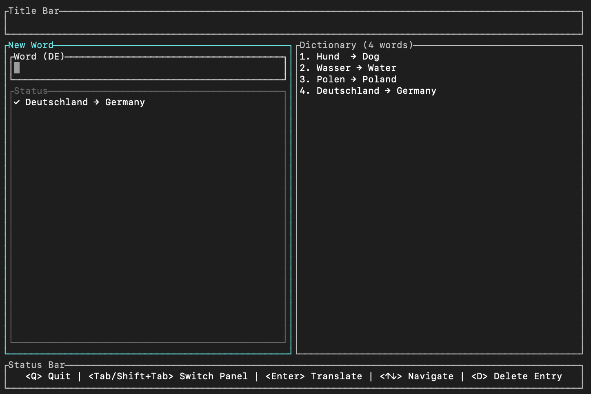

## Worder
Simple application allowing me to easily mark down words while learning German, without any fancy UI.
It works on the idea of letting you put anything into the JSON, because I don't trust my typing. Misspelling German words is very likely to happen.

The app also lets you remove entries and always loads the file on startup.

### What it does
- Type a German word, press Enter — it gets translated and saved automatically
- If no translation is found, the word is saved with `—` as a placeholder for manual entry later
- Entries can be removed from the list with `D`
- Everything is stored in `dictionary.json` in the working directory

### Stack
- **[ratatui](https://github.com/ratatui/ratatui)** — terminal UI framework
- **[crossterm](https://github.com/crossterm-rs/crossterm)** — cross-platform terminal input/output
- **[ureq](https://github.com/algesten/ureq)** — HTTP client for the translation API
- **[serde](https://serde.rs/) + serde_json** — JSON serialization for the dictionary file
- **[MyMemory API](https://mymemory.translated.net/)** — free translation API, no key needed

### Preview 


### Running
```bash
cargo run
```

### Tests
```bash
cargo test
```